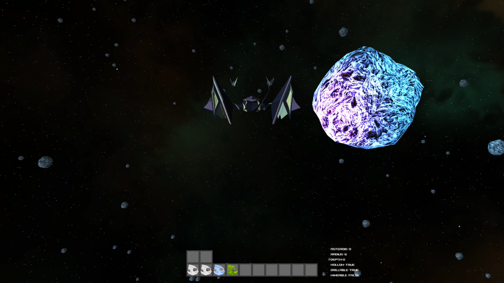

# Asteroid Miner 3D Game

## Motivation
This project is part of a BME course called Software Project Laboratory. The aim of the course was to teach us how to work on software in groups and get us ready for the professional world.

We did this project in a group of 5 people. We created all the necessary documentation and kept delivering our tasks under tight deadlines.

We tried to stand out and make a project that we're proud of and not just something that "works". Therefore, we collectively decided to learn how to make a 3D game in Java.

## What We  Used
- Java
- JMonkeyEngine
- Blender
- Photoshop
- Airtable 
- LucidUML
- WhiteStarUML
- Google Docs

The choice of the **Java language** was not our own but a basic requirement in the course. It is still a good choice for creating a game since OOP helps a lot in such projects.

**JMonkeyEngine** was our personal choice. A free software for creating 3D games in Java. We couldn't have asked for more! 

**Blender** and **Photoshop** were used for creating the game assets i.e. screens, backgrounds, buttons, asteroids, etc. 

**Airtable** wasused for dividing the tasks between the members and keep track of our progress using the KanBan board feature.

**LucidUML** and **WhiteStarUML** were used for creating the UML diagrams and structuring our project.

**Google Docs** was used for creating the documentation as a group.

## How to Install

1. Download this project.
2. Unzip it.
3. Go to the dist folder.
4. Click on the .jar file and have fun!

## How To Play

Humanity has decided to exploit the resources contained in asteroids. In order to do this, the settlers have to build a space station in the asteroid belt. The resources to build a space station would be too expensive to transport there, so the settlers have to mine them from the asteroids.

Players of the game control the settlers. Settlers wander in the asteroid belt with single person spaceships looking for resources.

Asteroids are covered in rocks. The depth of this rock mantle can vary from asteroid to asteroid. The important resources (water ice, iron, carbon, uranium, etc.) can be found in the core of the asteroids. Some resources (like uranium) are highly radioactive. There can be hollow asteroids, whose core is empty. The core of an asteroid is always homogeneous; it is always made of a single kind of a material.

A settler can do one operation in a single move. There are several operations, like travelling, drilling, mining, building robots, building teleportation-gates, etc. When a settler travels, they go to a neighboring asteroid (an asteroid may have multiple hundreds of neighbors). When a settler drills, they deepen the hole in the mantle with one unit. When a settler mines, they extract the resource from the core of the asteroid. This is only possible if the mantle has been completely drilled through. A single settler can only carry 10 units of resources, that’s the spaceships’ capacity.

 A hollow asteroid, however, can be filled with a unit of resource, counting as an operation.

Each asteroid contains some type of mineral and has a some number layers that are visible on the bottom right of the screen. These layers are labeled as radius. Depth tells you how many layers you have drilled.

There are some dangers lurking in the asteroid belt. When a fully drilled asteroid with a radioactive core is at perihelion, the asteroid explodes and kills any settler on it. Radioactive material, therefore, can only be mined when the asteroid is at aphelion. 

Sometimes a sun storm reaches the asteroid belt, and it is also dangerous to the settlers. A settler can only survive a sun storm if they hide in the core of a hollow asteroid. This, of course, is only possible if the mantle has been drilled through.

Using up 2 units of iron, a single unit of water ice and a single unit of uranium, the settlers can build a pair of teleportation-gates. The gates can be later deployed in the vicinity of the asteroid the settler is on. The two gates of a pair remain in contact for good, and entering either the traveller (settler, robot, etc) will be immediately transported to the other. The settler can bring the freshly built gates with themselves, but at the same time a single settler can only bring two gates. 

**Note:** At the start ofthe game the players will find that they already have enough materials for creating the gate. This is just because we kept the game in test mode.

The game can end in two ways. If all the settlers die, the players lose. If, however, they can mine at least three units of each resource and they collect those materials on a single asteroid, they can build the space station and the players win the game.

### **Note**
If you need to check the controls for the game you can check the Help screen at the start!

## Contributors and Credits

- Samer Bahri
- Mehdi Moazami
- Mohamed Rehaoulia
- Fedi Zerai

_________
### Good Luck and Have Fun! 
:partying_face: